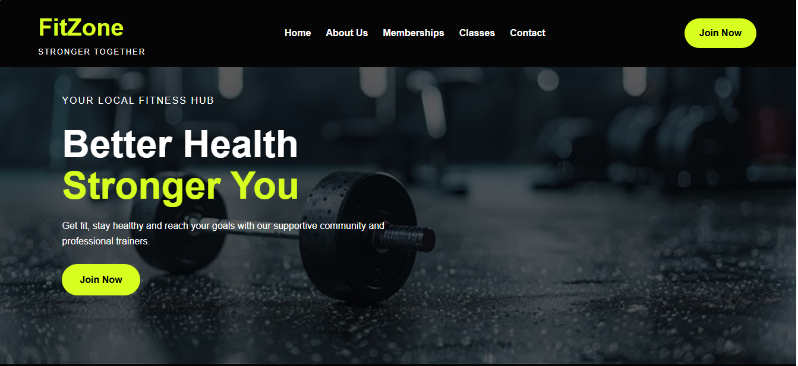
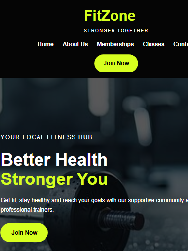
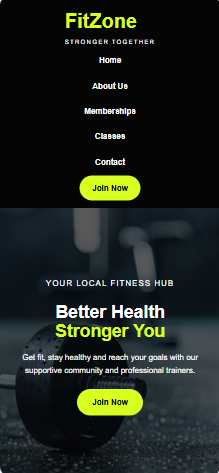

# FitZone Gym Website

## Student Information
Name: [MOHLATLEGO MOLOTO]
Module: Web Development
Project: Part 2 - Designing the Visuals
Website: FitZone Gym

---

# Project Overview

FitZone Gym is a fitness website designed to promote a healthy lifestyle and encourage users to join a professional gym environment.

The website provides information about:

- Gym services
- Membership plans
- Fitness classes
- Contact information
- Benefits of joining FitZone Gym

The website was developed using HTML and CSS and follows responsive design principles to ensure usability across different devices.

---

# Technologies Used

- HTML5
- CSS3
- Visual Studio Code
- GitHub

---

# Features

## Home Page
- Hero banner
- Call-to-action button
- Navigation menu

## About Us
- Information about the gym
- Mission and vision

## Membership Plans
- Basic Plan
- Standard Plan
- Premium Plan

## Classes
- Strength Training
- Cardio
- Yoga
- HIIT

## Contact Section
- Address
- Telephone Number
- Email Address
- Operating Hours

---

# CSS Features Implemented

## Typography
- Arial font family
- Responsive font sizes
- Consistent spacing

## Layout Structure
- Flexbox layout
- Responsive containers
- Card-based design

## Decoration and Colour
- Black background
- Lime green accent colour
- Hover effects
- Shadows and rounded corners

## Pseudo Classes
- :hover effects on:
  - Navigation links
  - Buttons
  - Membership cards
  - Class cards

---

## Responsive Design

The website has been tested on:

### Desktop View

### Tablet View

### Mobile View

Responsive features include:

- Flexible layouts
- Media queries
- Responsive images
- Mobile-friendly navigation
- Adjusted typography

---

# Changelog

## Part 2 Updates

- Created external stylesheet (style.css).
- Applied consistent colour scheme throughout website.
- Added Flexbox layouts for navigation and content sections.
- Added hover effects to buttons, navigation links and cards.
- Added responsive design using media queries.
- Tested website on desktop, tablet and mobile screens.
- Added responsive screenshots to README.
- Optimised images using responsive CSS.

---

# References

Font Awesome. (2026). Font Awesome Icons. Available at: https://fontawesome.com/ [Accessed 17 September 2026].

Mozilla Developer Network (MDN). (2026). CSS Documentation. Available at: https://developer.mozilla.org/ [Accessed 17 September 2026].

W3Schools. (2026). CSS Tutorial. Available at: https://www.w3schools.com/css/ [Accessed 17 September 2026].

Unsplash. (2026). Free Images. Available at: https://unsplash.com/ [Accessed 17 September 2026].

Pixabay. (2026). Free Images and Graphics. Available at: https://pixabay.com/ [Accessed 17 September 2026].

Google Fonts. (2026). Fonts and Typography. Available at: https://fonts.google.com/ [Accessed 17 September 2026].

---

# Repository Information

All project updates were committed regularly and pushed to GitHub throughout development.